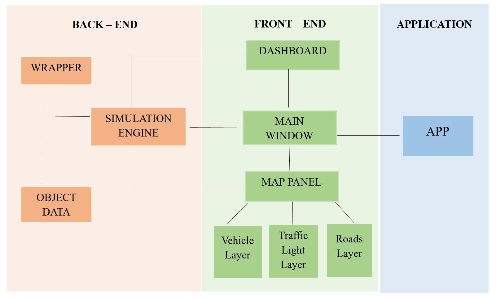
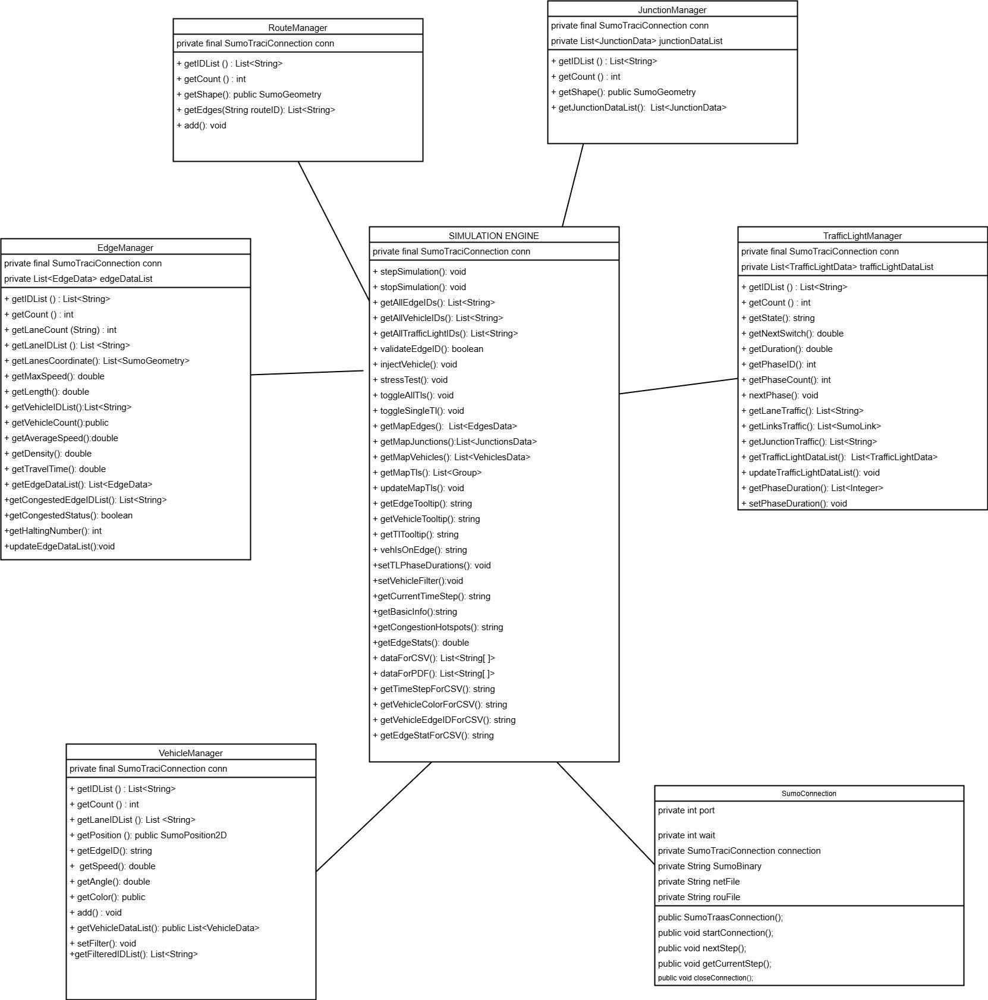
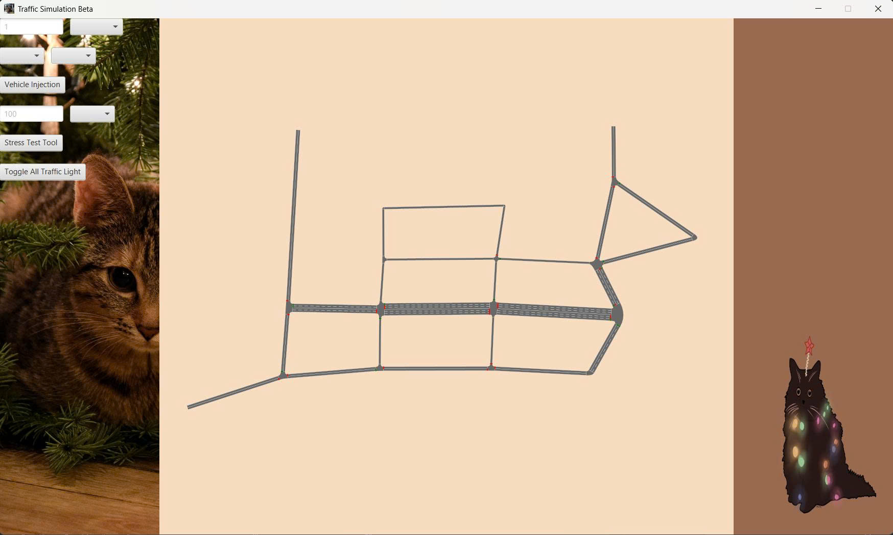

# Real-time Traffic Simulation System using SUMO and Java

This project integrates the SUMO Traffic Simulator with a Java application (Eclipse IDE) using the TraCI protocol via the TraaS Java library.
The goal is to allow real-time simulation control from a Java GUI, visualize vehicle flows, and support basic traffic management operations.

---

## Project Overview

This project is a simple **real-time traffic simulation** written in Java.  
It simulates:

- Vehicles moving on a predefined road network
- Traffic lights switching between red/yellow/green states
- Roads and map layout
- A GUI built using JavaFx (similar to SUMO-GUI)  
- Real-time behavior controlled by a JavaFx `Timer`

## Project Structure

```bash
traffic_simulation
├───.vscode
├───lib
├───src
│   ├───main
│   │   └───java
│   │       └───real_time_traffic_simulation_with_java
│   │           ├───alias
│   │           ├───cores
│   │           ├───gui
│   │           │   ├───mapLayer
│   │           │   └───resources
│   │           ├───lib
│   │           ├───SumoConfig
│   │           └───wrapper
│   └───test
│       └───java
│           └───real_time_traffic_simulation_with_java
└───target
    ├───classes
    │   └───real_time_traffic_simulation_with_java
    │       ├───alias
    │       ├───cores
    │       ├───gui
    │       │   ├───mapLayer
    │       │   └───resources
    │       └───wrapper
    ├───generated-sources
    │   └───annotations
    ├───maven-status
    │   └───maven-compiler-plugin
    │       └───compile
    │           └───default-compile
    └───test-classes
```

## Installation

- JavaSE-17 or higher (recommended Java 25)
- SUMO 1.25.0
- TraaS library
- Eclipse IDE
- JavaFX

---

## Features

- Object-oriented design with multiple classes  
- Traffic lights changes
- Road network rendering (horizontal + vertical)  
- Smooth animations  
- Modular structure split across multiple classes  
- Easy to extend with new features
- Real-time animated environment
- GUI similar in concept to SUMO-GUI
- Configurable update frequency
- Clean, modular Java project structure

---

## Team roles

|Name                              | Role                 | Description |
|----------------------------------|----------------------|-------------|
|Pham Tran Minh Anh                | GUI Designer            | Writes Java source code, including GUI and draw map.|
|Nguyen Thuy Anh                   | Developer                          | Writes Java source code, including SUMO connection, step simulation, GUI draws main window and dashboard. |
|Dieu Ngoc Thien An                | GUI designer                    | Writes Java source code, including design, layout, appearance. |
|Huynh Bao Tran                    | Developer                    | Writes Java source code, including design wrappers, GUI draw maps, and user controls.|
|Nguyen Ho Tuyet Phuong            | Developer, Document Writer                          | Write Java source code including traffic light, create diagrams, Javadoc and write report. |

---

## Technology Stack Summary

### Programming Language and Frameworks

- Java 25/ Java SE
- JavaFX for GUI development

### Tools and IDE

- SUMO 1.25.0
- TraaS library
- Eclipse IDE version 2025-09
- Git + Github for version control
- Visual Studio Code version 1.106

---

## Development Time Plan

### **Milestones Overview**

|Dates          | Milestone / Stage                  | Key Deliverables                            |
|----------------|------------------------------------|----------------------------------------------|
|Nov 1 – 27   | Milestone 1: Design & Prototype | Overview, diagrams, wrapper, mockups         |
|Nov 28 – Dec 14 | Milestone 2: Functional Prototype | Live demo, core features                     |
|Dec 15 – Jan 18 | Milestone 3: Finalize & Submission | Full GUI, export features, documentation     |

### **Timeline & Team roles Milestone 2

|Dates            |Tasks                        |Member                |
|----------------|------------------------------------|----------------------------------------------|
|03/12/2025 - 07/12/2025 | Working Application: Live SUMO connection     | Nguyen Thuy Anh        |
|03/12/2025 - 07/12/2025 | Working Application: Vehicle injection        | Huynh Bao Tran    |
|03/12/2025 - 07/12/2025 | Working Application: Traffic light control    | Huynh Bao Tran, Nguyen Ho Tuyet Phuong         |
|03/12/2025 - 07/12/2025 | Working Application: Map visualization        | Pham Tran Minh Anh, Huynh Bao Tran        |
|03/12/2025 - 07/12/2025 | Code Documentation & Fix project report       | Nguyen Ho Tuyet Phuong, Pham Tran Minh Anh                |
|03/12/2025 - 07/12/2025|Design: Design the layout, appearance, and user controls.|Dieu Ngoc Thien An, Nguyen Thuy Anh|
|07/12/2025 - 10/12/2025 | User Guide Draft & Test core features         | Nguyen Ho Tuyet Phuong, Huynh Bao Tran  |
|07/12/2025 - 11/12/2025 | Test Scenario                                 | Huynh Bao Tran, Nguyen Thuy Anh |
|08/12/2025 - 12/12/2025 | Progress Summary                              | Nguyen Ho Tuyet Phuong        |

### **Detailed Checklists**

#### Milestone 1 — Design & Prototype

- [x] Project overview (1 - 2 pages)
- [x] Architecture diagram
- [x] Class Design for TraaS wrapper (Vehicle, TrafficLight, etc.)
- [x] GUI Mockups (map view, control panels, dashboard)
- [x] SUMO Connection Demo (list traffic lights, step simulation)
- [x] Technology Stack Summary
- [x] Git Repository Setup (README, initial commit)
- [x] Team roles & time plan documentation

#### Milestone 2 — Functional Prototype

- [x] Running app with live SUMO ↔ Java communication
- [x] Vehicle injection + traffic light control
- [x] Map rendering inside GUI
- [x] Draft Javadoc & user guide
- [x] Test scenario (vehicles, signals, route)
- [x] Mid-project progress summary

#### Milestone 3 — Finalization & Submission

- [ ] Final polished GUI with full interactions
- [ ] Grouping/filtering logic for vehicles
- [ ] Traffic rule logic + timing optimization
- [ ] Export features (CSV & PDF)
- [ ] All documentation completed
- [ ] Final user guide + installation section
- [ ] Presentation preparation
- [ ] Team reflection & clean repository

## Achitechture Diagram and Class Design





## Demo UI



## License

This project is licensed under the MIT License - see the [LICENSE](LICENSE) file for details.
