# 📐 GUI Class Diagram - Biểu đồ lớp GUI đầy đủ

Đây là class diagram chi tiết của tất cả các class trong package `gui`, bao gồm **tất cả các thuộc tính (fields)** và **phương thức (methods)** quan trọng.

---

## 🎨 Class Diagram (Mermaid)

```mermaid
classDiagram
    %% ==================== JavaFX Classes ====================
    class Application {
        <<JavaFX>>
    }
    
    class StackPane {
        <<JavaFX>>
    }
    
    class VBox {
        <<JavaFX>>
    }
    
    %% ==================== MAIN WINDOW ====================
    class MainWindow {
        <<Application Entry Point>>
        +void start(Stage stage)
        +void main(String[] args)
    }
    
    %% ==================== MAP PANEL ====================
    class MapPanel {
        -double MIN_SCALE = 0.1
        -double MAX_SCALE = 15.0
        -double ZOOM_STEP = 1.15
        -double scale
        -double anchorX
        -double anchorY
        -double anchorTx
        -double anchorTy
        -Pane viewport
        -Group world
        -Group laneLayer
        -Group trafficLightLayer
        -Group vehicleLayer
        -Affine viewTransform
        -LaneManager laneManager
        -VehicleManager vehicleManager
        -TrafficLightManager trafficLightManager
        -Map~String, Group~ laneShapes
        -Map~String, Polygon~ vehicleShapes
        -Map~String, Circle~ trafficLightShapes
        
        +MapPanel()
        -void setupPanZoom()
        +void setManagers(LaneManager, VehicleManager, TrafficLightManager)
        +void renderMap()
        -void renderLane(String laneID)
        +void renderTrafficLights()
        -void renderTrafficLight(String tlID)
        +void updateVehicles()
        -void updateTrafficLights()
        -char getDominantState(String state)
        -void updateVehicle(String vehicleID)
        -Color convertSumoColor(SumoColor)
        -void centerView()
        +void recenterView()
        -double clamp(double v, double min, double max)
        -void zoomIn()
        -void zoomOut()
    }
    
    %% ==================== CONTROL PANEL ====================
    class ControlPanel {
        -Button startButton
        -Label timeLabel
        -SimulationEngine simulationEngine
        -boolean isSimulationRunning
        -ComboBox~String~ edgeComboBox
        -ComboBox~String~ colorComboBox
        -TextField quantityField
        -Button injectButton
        
        +ControlPanel()
        -void createConnectSection()
        -void createVehicleSection()
        -void createTrafficLightManagementSection()
        -HBox createTrafficLightBox(String lightName)
        +void setSimulationEngine(SimulationEngine)
        -void toggleSimulation()
        +void updateTime(int seconds)
    }
    
    %% ==================== DASHBOARD ====================
    class Dashboard {
        -Label totalVehiclesLabel
        -Label avgSpeedLabel
        -Label congestionLabel
        -Label avgTravelTimeLabel
        -ProgressBar edge1Bar
        -ProgressBar edge2Bar
        -ProgressBar edge3Bar
        -ProgressBar edge4Bar
        -CheckBox redCheckBox
        -CheckBox blueCheckBox
        -CheckBox greenCheckBox
        -CheckBox yellowCheckBox
        -CheckBox whiteCheckBox
        -CheckBox edge1CheckBox
        -CheckBox edge2CheckBox
        -CheckBox edge3CheckBox
        -CheckBox edge4CheckBox
        -Button exportButton
        
        +Dashboard()
        -void createStatisticsSection()
        -VBox createDensityBar(String edgeName, double value)
        -void createExportSection()
        +void updateStatistics(int totalVehicles, double avgSpeed, int congestionPoints, double avgTravelTime)
        +void updateDensity(double edge1, double edge2, double edge3, double edge4)
        -void showExportDialog()
        -void exportToCSV()
        -void exportToPDF()
    }
    
    %% ==================== RELATIONSHIPS ====================
    
    %% Inheritance (extends)
    MainWindow --|> Application : extends
    MapPanel --|> StackPane : extends
    ControlPanel --|> VBox : extends
    Dashboard --|> VBox : extends
    
    %% Composition (MainWindow tạo và sở hữu các panel)
    MainWindow *-- MapPanel : creates
    MainWindow *-- ControlPanel : creates
    MainWindow *-- Dashboard : creates
    
    %% Dependencies (sử dụng)
    MainWindow ..> SumoTraasConnection : uses
    MainWindow ..> LaneManager : creates
    MainWindow ..> VehicleManager : creates
    MainWindow ..> TrafficLightManager : creates
    MainWindow ..> SimulationEngine : creates
    
    MapPanel ..> LaneManager : uses
    MapPanel ..> VehicleManager : uses
    MapPanel ..> TrafficLightManager : uses
    
    ControlPanel ..> SimulationEngine : uses
    
    %% ==================== MANAGER CLASSES (Dependencies) ====================
    class LaneManager {
        <<Wrapper>>
        +List~String~ getIDList()
        +List~double[]~ getCoordinateList(String laneID)
        +double getWidth(String laneID)
    }
    
    class VehicleManager {
        <<Wrapper>>
        +List~String~ getIDList()
        +double[] getPosition(String vehicleID)
        +double getAngle(String vehicleID)
        +SumoColor getColor(String vehicleID)
    }
    
    class TrafficLightManager {
        <<Wrapper>>
        +List~String~ getIDList()
        +double[] getPosition(String tlID)
        +String getState(String tlID)
    }
    
    class SimulationEngine {
        <<Core>>
        +void start()
        +void stop()
        +void step()
        +int getCurrentTime()
    }
    
    class SumoTraasConnection {
        <<Wrapper>>
        +void startConnection()
        +SumoTraciConnection getConnection()
    }
```



---

## 📊 Giải thích quan hệ giữa các class

### 1️⃣ **Inheritance (Kế thừa - mũi tên rỗng ──|>)**
```
MainWindow extends Application       (JavaFX Application)
MapPanel extends StackPane          (JavaFX StackPane)
ControlPanel extends VBox           (JavaFX VBox)
Dashboard extends VBox              (JavaFX VBox)
```

### 2️⃣ **Composition (Chứa đựng - kim cương đen *--)**
```
MainWindow *-- MapPanel
MainWindow *-- ControlPanel  
MainWindow *-- Dashboard
```
**Nghĩa:** `MainWindow` tạo ra và sở hữu 3 panel. Nếu `MainWindow` mất thì 3 panel cũng mất.

### 3️⃣ **Dependency (Phụ thuộc - mũi tên đứt ..>)**
```
MainWindow ..> SumoTraasConnection
MainWindow ..> LaneManager
MainWindow ..> VehicleManager
MainWindow ..> TrafficLightManager
MainWindow ..> SimulationEngine

MapPanel ..> LaneManager
MapPanel ..> VehicleManager
MapPanel ..> TrafficLightManager

ControlPanel ..> SimulationEngine
```
**Nghĩa:** Các class GUI sử dụng các Manager và Engine để lấy dữ liệu từ SUMO.

---

## 🏗️ Kiến trúc phân tầng

```
┌─────────────────────────────────────────┐
│        MainWindow (Application)          │
│  - Khởi tạo SUMO Connection              │
│  - Tạo 3 Managers                        │
│  - Tạo SimulationEngine                  │
│  - Tạo 3 Panels                          │
└───────────┬─────────────────────────────┘
            │
            │ creates & manages
            │
    ┌───────┴────────┬──────────────┬───────────────┐
    │                │              │               │
    ▼                ▼              ▼               ▼
┌─────────┐  ┌──────────────┐  ┌────────────┐  ┌──────────────┐
│Control  │  │   MapPanel   │  │ Dashboard  │  │ Simulation   │
│Panel    │  │              │  │            │  │   Engine     │
│         │  │ - Render map │  │ - Stats    │  │              │
│- Start/ │  │ - Zoom/Pan   │  │ - Density  │  │ - Timeline   │
│  Stop   │  │ - Update     │  │ - Export   │  │ - Control    │
│- Inject │  │   vehicles   │  │            │  │   loop       │
│  vehicle│  │              │  │            │  │              │
│- Traffic│  │              │  │            │  │              │
│  Light  │  │              │  │            │  │              │
└─────┬───┘  └──────┬───────┘  └─────┬──────┘  └──────┬───────┘
      │             │                │                │
      │             │                │                │
      └─────────────┴────────────────┴────────────────┘
                           │
                           │ uses
                           │
        ┌──────────────────┴──────────────────┐
        │                                     │
        ▼                                     ▼
┌────────────────┐                  ┌──────────────────┐
│    Managers    │                  │ SumoTraas        │
│                │                  │ Connection       │
│ - LaneManager  │◄─────uses────────│                  │
│ - VehicleMgr   │                  │ - TCP Socket     │
│ - TrafficLight │                  │ - Port 8813      │
│   Manager      │                  │                  │
└────────────────┘                  └─────────┬────────┘
        │                                     │
        │ TraCI API                           │
        │                                     │
        └─────────────────┬───────────────────┘
                          │
                          ▼
                  ┌───────────────┐
                  │  SUMO Process │
                  │  (sumo.exe)   │
                  └───────────────┘
```

---

## 🔍 Chi tiết từng class

### 🪟 **MainWindow** (Cửa sổ chính)
- **Extends:** `javafx.application.Application`
- **Vai trò:** Entry point của ứng dụng, khởi tạo SUMO và tạo GUI
- **Methods:**
  - `start(Stage)`: Khởi tạo GUI và SUMO connection
  - `main(String[])`: Entry point chạy ứng dụng

---

### 🗺️ **MapPanel** (Bản đồ)
- **Extends:** `StackPane`
- **Vai trò:** Hiển thị bản đồ, xe, đèn tín hiệu với zoom/pan
- **Thuộc tính:**
  - **Zoom settings:** `MIN_SCALE`, `MAX_SCALE`, `ZOOM_STEP`, `scale`
  - **Pan settings:** `anchorX`, `anchorY`, `anchorTx`, `anchorTy`
  - **Layers:** `viewport`, `world`, `laneLayer`, `trafficLightLayer`, `vehicleLayer`
  - **Transform:** `viewTransform` (Affine)
  - **Managers:** `laneManager`, `vehicleManager`, `trafficLightManager`
  - **Caches:** `laneShapes`, `vehicleShapes`, `trafficLightShapes`

- **Methods:**
  - `renderMap()`: Render tất cả lanes
  - `renderLane(String)`: Render 1 lane cụ thể
  - `renderTrafficLights()`: Render tất cả đèn tín hiệu
  - `updateVehicles()`: Cập nhật vị trí xe mỗi frame
  - `setupPanZoom()`: Thiết lập mouse events cho pan/zoom
  - `centerView()`: Auto-center map vào viewport
  - `zoomIn()` / `zoomOut()`: Zoom in/out từ nút

---

### 🎮 **ControlPanel** (Bảng điều khiển)
- **Extends:** `VBox`
- **Vai trò:** Điều khiển simulation (Start/Stop, Inject xe, Traffic Light)
- **Thuộc tính:**
  - **Connect section:** `startButton`, `timeLabel`, `isSimulationRunning`
  - **Vehicle section:** `edgeComboBox`, `colorComboBox`, `quantityField`, `injectButton`
  - **Reference:** `simulationEngine`

- **Methods:**
  - `createConnectSection()`: Tạo section Start/Stop
  - `createVehicleSection()`: Tạo section Inject xe
  - `createTrafficLightManagementSection()`: Tạo section Traffic Light
  - `toggleSimulation()`: Bật/tắt simulation
  - `updateTime(int)`: Cập nhật thời gian hiển thị

---

### 📊 **Dashboard** (Bảng thống kê)
- **Extends:** `VBox`
- **Vai trò:** Hiển thị thống kê và export báo cáo
- **Thuộc tính:**
  - **Statistics labels:** `totalVehiclesLabel`, `avgSpeedLabel`, `congestionLabel`, `avgTravelTimeLabel`
  - **Density progress bars:** `edge1Bar`, `edge2Bar`, `edge3Bar`, `edge4Bar`
  - **Export filters:** `redCheckBox`, `blueCheckBox`, `greenCheckBox`, `yellowCheckBox`, `whiteCheckBox`
  - **Edge filters:** `edge1CheckBox`, `edge2CheckBox`, `edge3CheckBox`, `edge4CheckBox`
  - **Export button:** `exportButton`

- **Methods:**
  - `createStatisticsSection()`: Tạo section thống kê
  - `createExportSection()`: Tạo section export
  - `updateStatistics(...)`: Cập nhật số liệu thống kê
  - `updateDensity(...)`: Cập nhật density bars
  - `showExportDialog()`: Hiển thị dialog export
  - `exportToCSV()`: Export ra CSV
  - `exportToPDF()`: Export ra PDF

---

## 🔗 Luồng dữ liệu (Data Flow)

```
┌─────────────────────────────────────────────────────────┐
│ 1. MainWindow.start()                                   │
│    - SumoTraasConnection.startConnection()              │
│    - Tạo LaneManager, VehicleManager, TrafficLightMgr   │
│    - Tạo SimulationEngine                               │
└───────────────────────┬─────────────────────────────────┘
                        │
                        ▼
┌─────────────────────────────────────────────────────────┐
│ 2. MapPanel.setManagers(...)                            │
│    - Lưu reference đến 3 managers                       │
└───────────────────────┬─────────────────────────────────┘
                        │
                        ▼
┌─────────────────────────────────────────────────────────┐
│ 3. MapPanel.renderMap()                                 │
│    - laneManager.getIDList() → List<String>             │
│    - For each lane:                                     │
│      • laneManager.getCoordinateList(laneID)            │
│      • Draw JavaFX Lines                                │
└───────────────────────┬─────────────────────────────────┘
                        │
                        ▼
┌─────────────────────────────────────────────────────────┐
│ 4. ControlPanel.toggleSimulation()                      │
│    - simulationEngine.start()                           │
└───────────────────────┬─────────────────────────────────┘
                        │
                        ▼
┌─────────────────────────────────────────────────────────┐
│ 5. SimulationEngine (Timeline loop)                     │
│    - sumoConn.doSimStep()                               │
│    - mapPanel.updateVehicles()                          │
│    - mapPanel.updateTrafficLights()                     │
│    - dashboard.updateStatistics(...)                    │
└─────────────────────────────────────────────────────────┘
```

---

## 🎯 Tóm tắt

### **4 Class chính:**
1. **MainWindow** - Điều phối toàn bộ ứng dụng
2. **MapPanel** - Hiển thị bản đồ và animation
3. **ControlPanel** - Điều khiển simulation
4. **Dashboard** - Thống kê và export

### **3 loại quan hệ:**
- **Extends** (Kế thừa JavaFX classes)
- **Composition** (MainWindow chứa 3 panels)
- **Dependency** (Sử dụng Managers để lấy dữ liệu SUMO)

### **Kiến trúc:**
- **MVC-like pattern:** GUI (View) ← Managers (Controller) ← SUMO (Model)
- **Separation of Concerns:** Mỗi panel có trách nhiệm riêng
- **Data flow:** SUMO → Managers → GUI components
